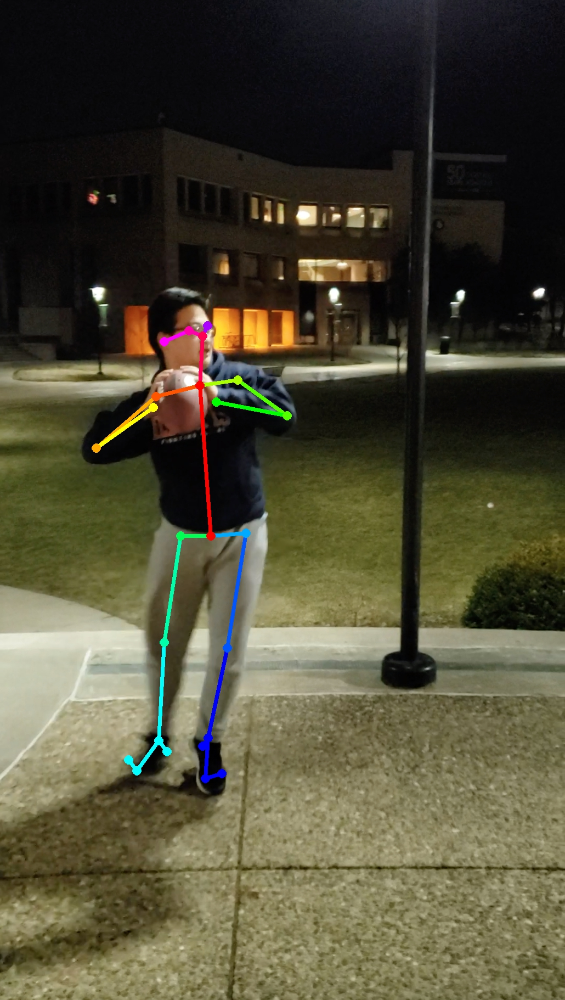

# PEMM
Performance Enchancing Mechanical Motions  
Analyzes the skeletal form of athletes against user inputted video, and provides feedback to improve form by comparing against professionals in the sport.   
Made with OpenPose and OpenCV for Pickhacks 2019

